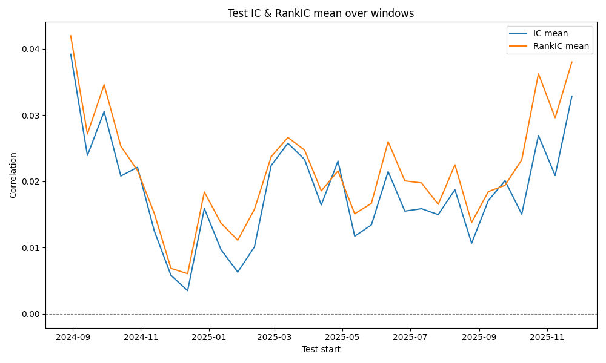
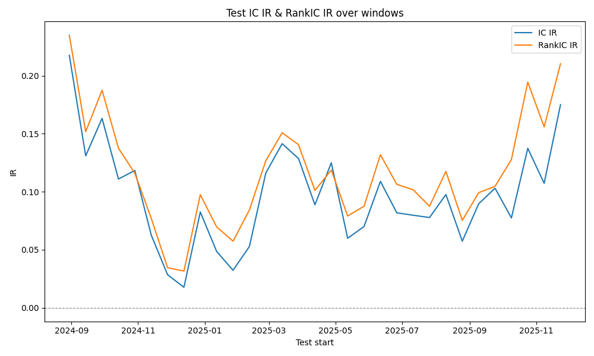
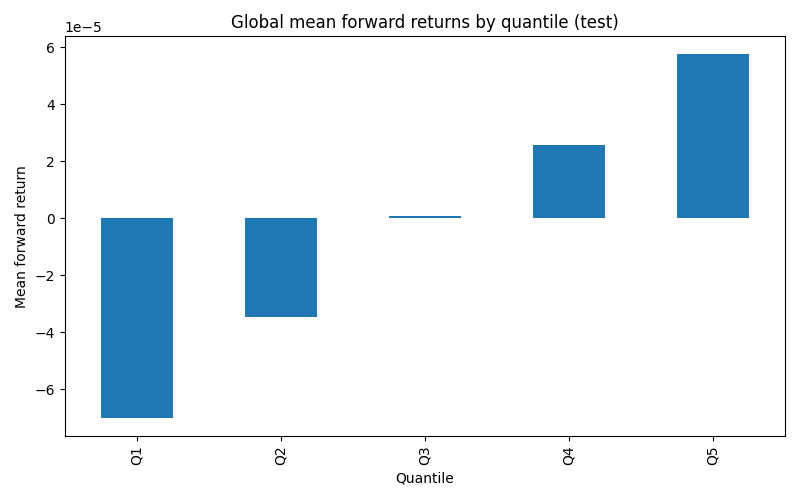
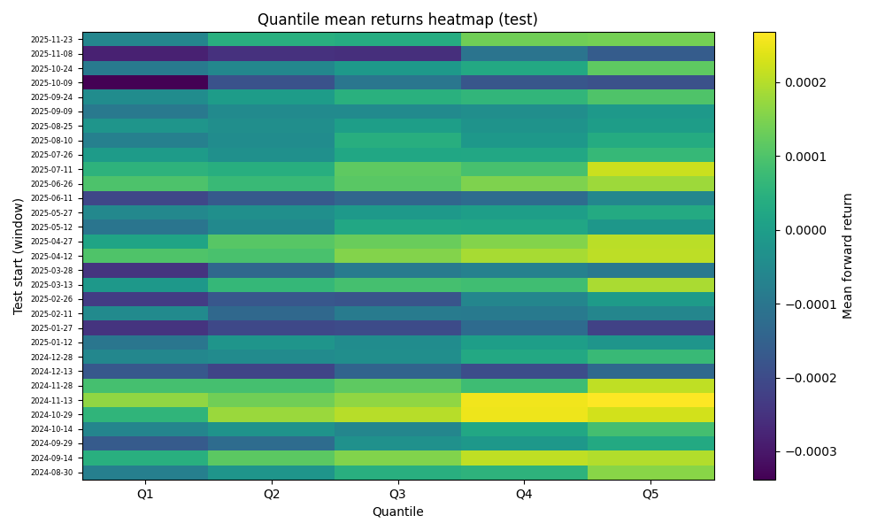
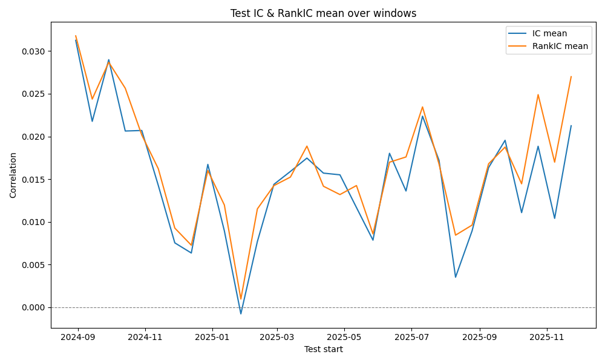
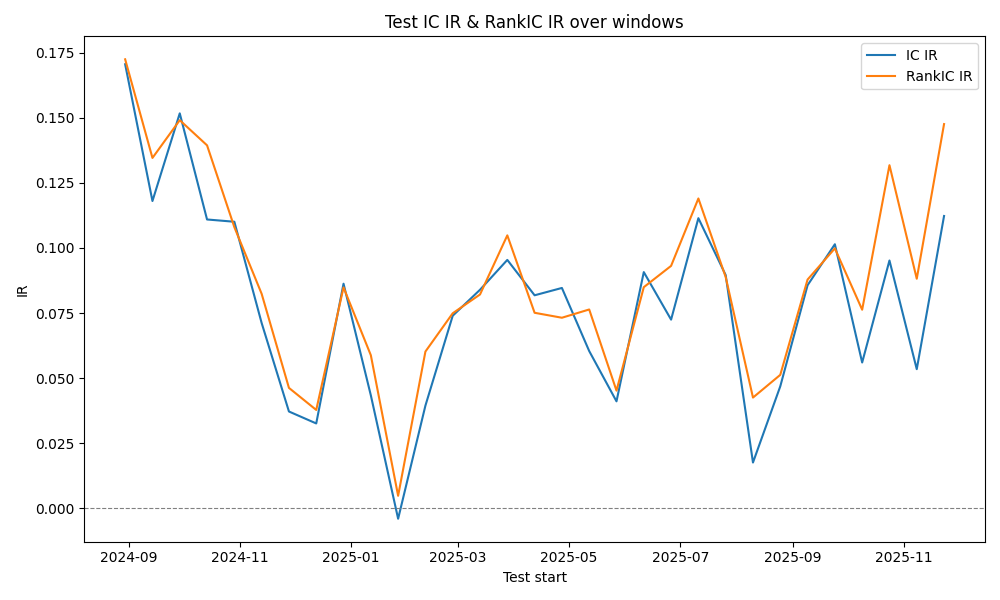
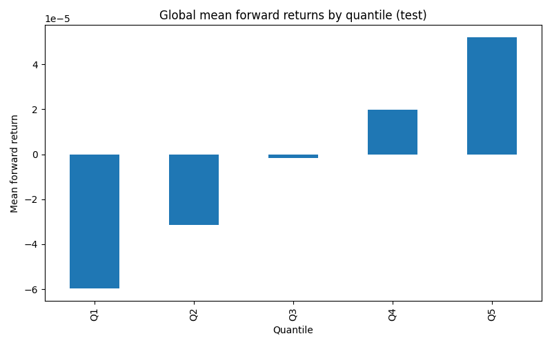
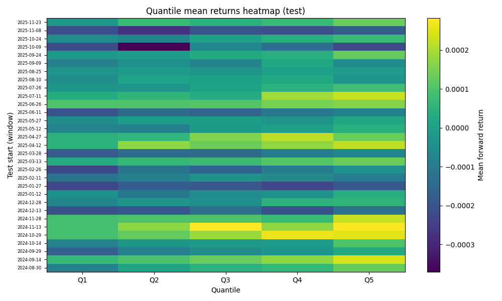

# Crypto_factor_research：从人工单因子到遗传算法（GA/GP）新增因子的完整流程  
# Crypto_factor_research: End-to-end workflow from manual single factors to GA/GP-evolved factors

> 版本：（2025-12-28）  
> Version:  (2025-12-28)

---

## 0. 项目目标与整体闭环 / Project goal & closed-loop workflow


本项目面向 Coin/USDT 永续合约的 15m 级别数据，构建 **截面因子（cross-sectional factors）** 来预测 **未来 1 根 15m K 线收益（horizon=1）**。框架已经形成可复现的闭环：

1. 数据读取与 QC（Binance 15m OHLCV panel）
2. 因子计算（snapshot-only 截面范式）
3. Walk-forward 评估（IC/RankIC、分组、Long–Short、稳定性/换手）
4. 可视化与实验归档（时间序列、统计摘要、图像、summary.json）
5. （第二阶段）基于 GA/GP 的自动进化：生成候选 → 快速评估 → 去重筛选 → 导出为可直接回测的新因子

 
This project targets 15-minute Coin/USDT perpetual futures data and builds **cross-sectional factors** to predict the **next-bar (15m) forward return (horizon=1)**. We already have a reproducible closed-loop pipeline:

1. Data loading & QC (Binance 15m OHLCV panel)
2. Factor computation (snapshot-only cross-sectional paradigm)
3. Walk-forward evaluation (IC/RankIC, quantile groups, long–short, stability/turnover)
4. Visualization & experiment logging (series, summaries, plots, `summary.json`)
5. (Phase 2) GA/GP-driven evolution: generate candidates → fast evaluation → dedup & selection → export as usable factors

---

## 1. 人工单因子基线表现 / Manual single-factor baseline performance


### 1.1 评估口径（关键指标）/ Evaluation metrics (key indicators)

**关键指标**
- **RankIC mean / IR**：因子与 forward return 的 Spearman 相关均值与信息比率。
- **Long–Short Sharpe**：Top-quantile minus Bottom-quantile 的年化 Sharpe（按 15m 年化频率计算）。
- **Turnover**：基于截面标准化权重的平均双边换手（越低越好，代表交易成本压力更小）。
- **Autocorr**：因子（每个标的时间序列）的一阶自相关均值（过高可能意味着“黏滞/缓慢”或结构性偏差）。

- **RankIC mean / IR**: Spearman correlation with forward returns (mean and information ratio).
- **Long–Short Sharpe**: Annualized Sharpe of Top-minus-Bottom quantile portfolio (annualization based on 15m frequency).
- **Turnover**: Average two-sided turnover from normalized cross-sectional weights (lower is better).
- **Autocorr**: Average lag-1 autocorrelation across symbols (very high values may indicate “sticky” signals or structural bias).

> 注：15m 频率下年化系数较大，Sharpe 绝对值主要用于**相对比较**。  
> Note: Annualization at 15m can yield large Sharpe values; interpret it **comparatively**.

### 1.2 基线概览（全体人工单因子）/ Baseline overview (all manual factors)


- 人工单因子数量：**68**
- 中位数 |RankIC IR|：**0.0370**
- 最佳 |RankIC IR|：**0.2423**
- 中位数 Long–Short Sharpe：**0.5085**
- 最佳 Long–Short Sharpe：**19.7489**
- 中位数 Turnover：**1.1292**
- 中位数 Autocorr：**0.0646**


- manual factors evaluated: **68**
- Median |RankIC IR|: **0.0370**
- Best |RankIC IR|: **0.2423**
- Median Long–Short Sharpe: **0.5085**
- Best Long–Short Sharpe: **19.7489**
- Median turnover: **1.1292**
- Median autocorr: **0.0646**

### 1.3 人工单因子 Top 表现/ Top manual factors 

下表为人工单因子中，按 |RankIC IR| 排序的 Top。  
The table below shows top manual factors ranked by |RankIC IR| .

| ID       |   RankIC  |   RankIC IR |   LS Sharpe |   Turnover |   Autocorr |
|:---------|--------------:|------------:|------------:|-----------:|-----------:|
| Factor 1 |       -0.0473 |     -0.2423 |     19.5697 |     1.334  |    -0.0194 |
| Factor 2 |       -0.0473 |     -0.2423 |     19.5697 |     1.4149 |    -0      |
| Factor 3 |       -0.0473 |     -0.2422 |     19.5282 |     1.3335 |    -0.0193 |
| Factor 4 |       -0.0565 |     -0.2405 |     18.1303 |     1.3239 |    -0.0336 |
| Factor 5 |       -0.0564 |     -0.2404 |     18.1424 |     1.3909 |    -0.0313 |
| Factor 6 |       -0.0461 |     -0.2293 |     19.7489 |     1.3275 |    -0.0274 |
| Factor 7 |       -0.0452 |     -0.2257 |     18.866  |     1.129  |    -0.0081 |
| Factor 8 |       -0.0544 |     -0.2184 |     15.1948 |     1.1292 |     0.1115 |
| Factor 9 |       -0.0396 |     -0.1991 |     15.242  |     1.3466 |    -0.0376 |

---


**单因子在时间序列上的表现/ Performance on time series**

**Example 1**






**Example 2**







## 2. 遗传算法新增因子的实现流程/ GA-evolved factor pipeline 


### 2.1 设计原则 / Design principles


- **复用现有框架**：因子表达（expr AST + transform）与评估模块（IC/分组/稳定性/walk-forward）全部复用。
- **snapshot-only 约束**：初期只允许用当前 bar 的衍生特征 + 截面变换，降低过拟合与工程复杂度。
- **多指标适应度**：同时考虑预测力（RankIC）与可交易性（Turnover/稳定性），并支持扩展更多指标（如 MI）。
- **去重优先**：结构去重 + 相关性去重，避免种群坍塌为一堆高度同质的表达式。


- **Reuse existing infrastructure**: reuse expr AST + transforms and evaluation modules (IC/grouping/stability/walk-forward).
- **Snapshot-only constraints**: only current-bar derived features + cross-sectional transforms at early stage.
- **Multi-metric fitness**: balance predictiveness (RankIC) and tradability (turnover/stability), extensible to more metrics (e.g., MI).
- **Dedup first**: structural + correlation dedup to prevent population collapse into near-duplicates.

### 2.2 关键模块与数据流 / Key modules & data flow

```text
(1) Seeds + Random init
        |
(2) Mutation / Crossover on expr trees  + optional transform mutation
        |
(3) Fast evaluator (load panel once) -> metrics -> scalar fitness
        |
(4) Dedup: structural key + corr threshold
        |
(5) Selection: elites + tournament -> next generation
        |
(6) Export top-K to auto_evolved family -> reuse main_run_factor.py for full walk-forward
```


- **初始化（Population）**：混合“人工因子 seeds + 随机表达式”。
- **遗传操作（Ops）**：子树替换 / unary 包裹 / binary 插入 / 常数扰动 / transform 切换。
- **快速评估（Evaluator）**：一次加载 panel + forward returns；候选因子批量跑指标，避免反复 IO。
- **导出（Export）**：把 Top-K 写成 `auto_evolved.py` 的 `SPECS`，直接接入因子注册表，立刻能用你既有回测脚本跑完整评估。


- **Population init**: mix of manual seeds + random expressions.
- **Genetic ops**: subtree replace / unary wrap / binary insert / constant jitter / transform mutation.
- **Fast evaluator**: load panel + labels once; batch-evaluate candidates to avoid repeated IO.
- **Export**: write Top-K as `SPECS` into `auto_evolved.py`, register them, and reuse existing backtest scripts.

---

## 3. 新增因子表现对比 / Performance comparison: manual vs GA-evolved

### 3.1 GA 因子概览 / GA overview

- GA 新增因子数量：**38**
- 中位数 |RankIC IR|：**0.2088**
- 最佳 |RankIC IR|：**0.2539**
- 中位数 Long–Short Sharpe：**13.8421**
- 最佳 Long–Short Sharpe：**20.3663**
- 中位数 Turnover：**1.3151**
- 中位数 Autocorr：**0.0012**（更接近 0，通常更“快/不黏滞”）


- GA factors evaluated: **38**
- Median |RankIC IR|: **0.2088**
- Best |RankIC IR|: **0.2539**
- Median Long–Short Sharpe: **13.8421**
- Best Long–Short Sharpe: **20.3663**
- Median turnover: **1.3151**
- Median autocorr: **0.0012** (closer to 0 → often “less sticky”)

### 3.2 GA 因子 Top 表现 / Top GA factors

下表为 GA 因子中按 |RankIC IR| 排序的 Top。  
The table below shows top GA factors ranked by |RankIC IR|.

| ID          |   RankIC  |   RankIC IR |   LS Sharpe |   Turnover |   Autocorr |
|:------------|--------------:|------------:|------------:|-----------:|-----------:|
| GA Factor 1 |       -0.0596 |     -0.2539 |     20.3663 |     1.3664 |     0.0299 |
| GA Factor 2 |       -0.0565 |     -0.2405 |     18.1424 |     1.4281 |    -0.0439 |
| GA Factor 3 |       -0.0535 |     -0.2397 |     14.3005 |     0.9885 |     0.0071 |
| GA Factor 4 |       -0.0509 |     -0.2307 |     16.0253 |     1.145  |    -0.0001 |
| GA Factor 5 |       -0.0478 |     -0.2306 |     17.7563 |     1.3894 |    -0.0163 |
| GA Factor 6 |       -0.0478 |     -0.2306 |     17.7563 |     1.3894 |    -0.0454 |
| GA Factor 7 |       -0.0525 |     -0.2218 |      4.9966 |     0.4649 |     0.0099 |
| GA Factor 8 |       -0.0463 |     -0.2191 |     18.9732 |     1.3653 |    -0.0149 |
| GA Factor 9 |       -0.0463 |     -0.2191 |     18.9727 |     1.3653 |    -0.0149 |

### 3.3 结论性对比（项目阶段性）/ Practical takeaways (stage summary)

**结论**
- 从“中位数水平”看：GA 因子的 |RankIC IR| 与 Long–Short Sharpe 整体显著高于人工因子集合（因为 GA 产物本质上已被筛选过）。
- 代价：GA 因子整体 **Turnover 略高**（更“激进”），但 Autocorr 更接近 0（更“快”）。
- 推荐做法：**先用 fast_eval 找结构 → 再对 Top-K 跑完整 walk-forward → 再加成本/滑点模型做净 alpha 过滤**。

**summary**
- At the median level, GA factors show materially stronger |RankIC IR| and long–short Sharpe than the full manual set (GA outputs are already selected).
- Trade-off: GA factors tend to have slightly higher turnover (more aggressive), while autocorr is closer to zero (less “sticky”).
- Recommended workflow: **fast_eval for structure search → full walk-forward for Top-K → apply cost/slippage filters for net alpha**.

---

## 4. 最小可复现工作流 / Minimal reproducible workflow checklist


1. 固定数据与参数：symbols、频率（15m）、horizon=1、walk-forward 配置  
2. 跑人工因子：输出实验归档（含图像与 summary.json）  
3. 启动 GA：设定 `pop/gen/children/elite` + 结构/相关性去重阈值  
4. 导出 Top-K：注册为 `auto_evolved` 家族  
5. 对 Top-K 跑完整回测与风控指标（含交易成本），形成“可交易因子池”


1. Freeze data & config: symbols, 15m frequency, horizon=1, walk-forward setup  
2. Run manual factors: log full experiments (plots + `summary.json`)  
3. Run GA: configure `pop/gen/children/elite` + structural/corr dedup thresholds  
4. Export Top-K: register into `auto_evolved` family  
5. Full backtest & risk/cost checks on Top-K → build a tradable factor pool
