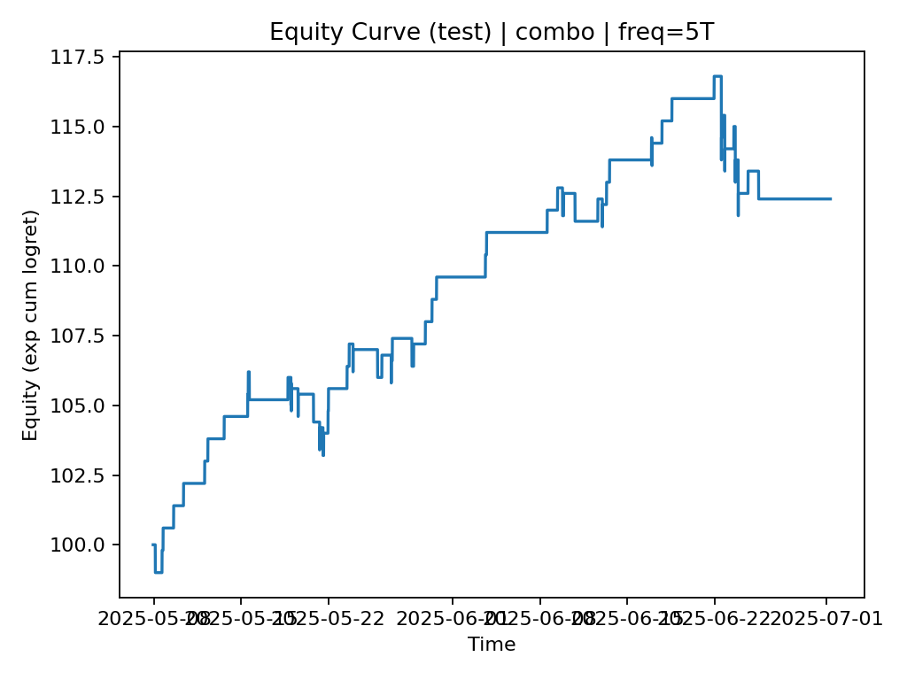
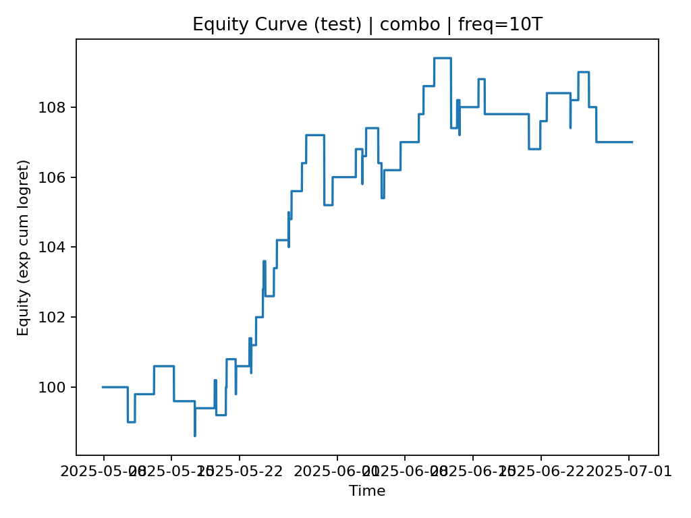
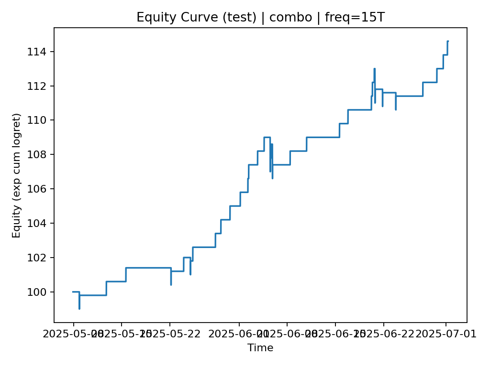
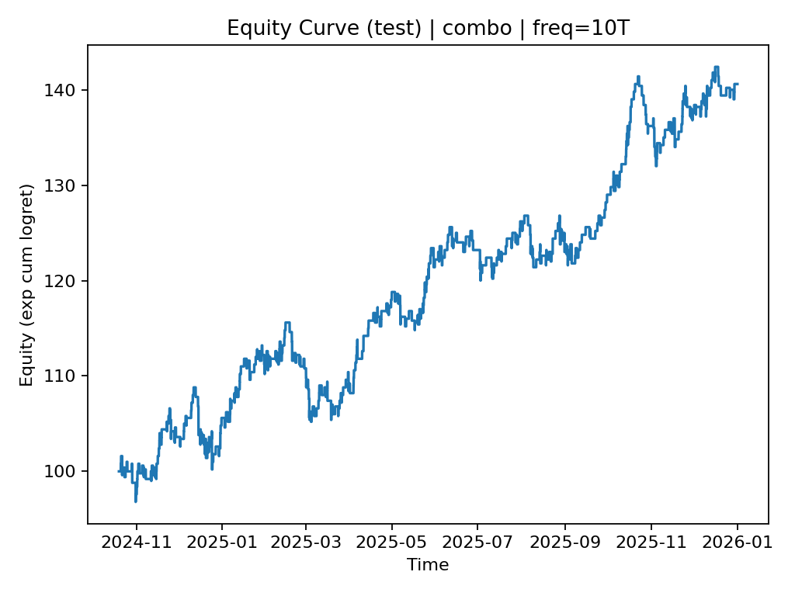
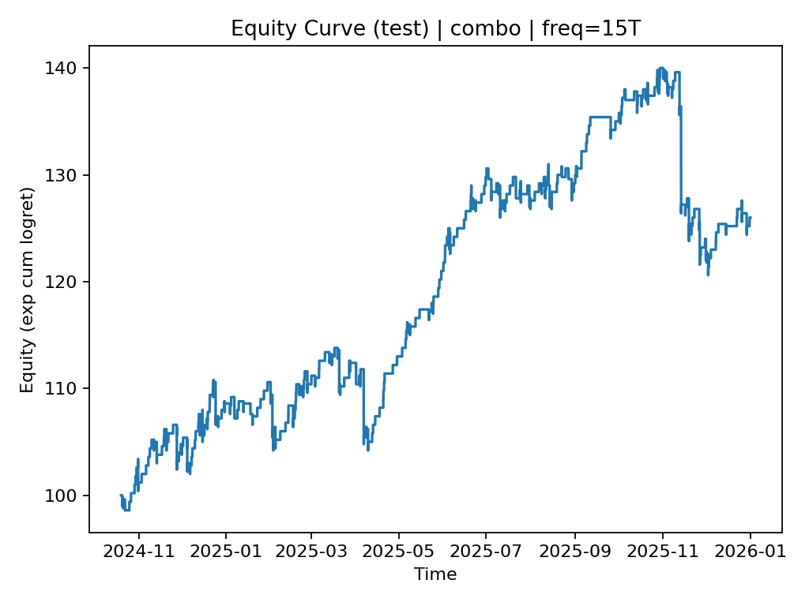

# BTC binary backtest Results Report — Multi-Frequency Backtests (5/10/15 mins)

> This document is a **performance summary** of a rules-based signal deployed at three bar frequencies (**5min / 10min / 15min**).  
>  It focuses on **results**, **win rate**, **trade count**, **payout structure**, and **risk statistics**.

---

## 1) Evaluation Setup (What was tested)

### Frequencies
- **5 minutes (5T)**
- **10 minutes (10T)**
- **15 minutes (15T)**

### Backtest periods
We report results on **two distinct datasets**:

1) **Period A — Initial grid search & selection**
- Data window: **2025-01-01 → 2025-07-01**
- Split: **Train/Test = 70% / 30%** (time-based)
- Goal: select parameters via grid search; **report only test performance** below.

2) **Period B — Extended validation**
- Data window: **2024-10-21 → 2026-01-01**
(time-based)
- Goal: stress-test robustness across multiple regimes; **report only test performance** below.

### Payout structure (event-contract style)
All results below use the same **non-strategy parameters**:

- Initial capital: **100**
- Fee: **0**
- **Win payout:** +0.8  
- **Loss cost:** −1.0  

**Break-even win rate** under this payout:
$$
p_{BE}=\frac{1.0}{1.0+0.8}=0.5556\ (\approx 55.56\%)
$$
> Interpretation: if win rate (accuracy on traded signals) is **above 55.56%**, the expected value per trade is positive (ignoring friction).

---

## 2) Metrics Explained (Public, non-strategy)

- **Trades (n_trades):** number of executed signals in the test segment  
- **Win rate (win_rate):** fraction of winning trades in test  
- **Total PnL (total_pnl):** sum of per-trade payouts (+0.8 / −1.0)  
- **Avg PnL per trade (avg_pnl_per_trade):** total_pnl / n_trades  
- **Final cash (final_cash):** initial_cash + total_pnl (under the payout scheme)  
- **Max win / loss streak:** longest consecutive wins / losses  
- **Max drawdown (MDD):** peak-to-trough decline on the **payout-based equity curve**  

> Note: “Sharpe” and “cum_ret” from signal evaluation are included in logs but are not central here because the primary objective is **event-style directional win rate + payout-based equity**.

---

## 3) Results Summary (At a glance)

### Period A (2025-01-01 → 2025-07-01, test segment)
- Best observed **single-frequency** win rate: **15T = 74.42%** (43 trades)
- All reported configurations have win rate **> break-even (55.56%)**
- Drawdowns in this short window remain **moderate** (≈ 2%–8% in payout-equity terms)

### Period B (2024-10-21 → 2026-01-01, re-test segment)
- **10T** and **15T** maintain win rates **~59–60%**, remaining **profitable** under the same payout scheme.
- **5T** shows **material sensitivity** across regimes:
  - One configuration is **near break-even** (≈55.66%) with **very large drawdown**.
  - Others fall **below break-even**, turning **negative** under the payout scheme.

---

## 4) Detailed Results — Period A (2025-01-01 → 2025-07-01)

### 4.1 5T — Test performance (three candidate configurations)

| Config | Trades | Win rate | Total PnL | Avg PnL/trade | Final cash | Max win streak | Max loss streak | MDD |
|---|---:|---:|---:|---:|---:|---:|---:|---:|
| 5T-A1 | 309 | 61.49% | +33.0 | 0.1068 | 133.0 | 7 | 5 | −7.68% |
| 5T-A2 | 74  | 64.86% | +12.4 | 0.1676 | 112.4 | 9 | 3 | −4.28% |
| 5T-A3 | 41  | 63.41% | +5.8  | 0.1415 | 105.8 | 8 | 3 | −5.41% |

**Notes (Period A, 5T):**
- Higher win rate tends to come with fewer trades (e.g., A2/A3).  
- A1 trades more frequently and produces higher absolute PnL in this short sample.

**Placeholders (Period A, 5T images):**
- Equity curve (A2):  
  

---

### 4.2 10T — Test performance

| Trades | Win rate | Total PnL | Avg PnL/trade | Final cash | Max win streak | Max loss streak | MDD |
|---:|---:|---:|---:|---:|---:|---:|---:|
| 56 | 62.50% | +7.0 | 0.1250 | 107.0 | 5 | 2 | −2.38% |

**Placeholders (Period A, 10T images):**
- 

---

### 4.3 15T — Test performance

| Trades | Win rate | Total PnL | Avg PnL/trade | Final cash | Max win streak | Max loss streak | MDD |
|---:|---:|---:|---:|---:|---:|---:|---:|
| 43 | 74.42% | +14.6 | 0.3395 | 114.6 | 10 | 2 | −2.20% |

**Highlights (Period A, 15T):**
- Highest observed test win rate among the three frequencies in Period A.
- Strong per-trade expectancy under the given payout structure.

**Placeholders (Period A, 15T images):**
- 

---

## 5) Detailed Results — Period B (2024-10-21 → 2026-01-01)

> Period B is a longer validation set intended to test robustness across multiple market regimes.  

### 5.1 5T — Test performance (same three candidate configurations)

| Config | Trades | Win rate | Total PnL | Avg PnL/trade | Final cash | Max win streak | Max loss streak | MDD |
|---|---:|---:|---:|---:|---:|---:|---:|---:|
| 5T-B1 | 2687 | 55.60% | +2.2  | 0.0008  | 102.2 | 13 | 8 | **−48.86%** |
| 5T-B2 | 1032 | 53.10% | −45.6 | −0.0442 | 54.4  | 10 | 9 | **−51.15%** |
| 5T-B3 | 586  | 55.12% | −4.6  | −0.0078 | 95.4  | 11 | 7 | −23.46% |

**Highlights (Period B, 5T):**
- 5T-B1 is **approximately break-even** (win rate slightly above 55.56%), but shows **very large drawdown**, suggesting high path-dependence and regime sensitivity.
- 5T-B2 and 5T-B3 fall **below break-even** and are **negative** under the payout scheme.

**Placeholders (Period B, 5T images):**

---

### 5.2 10T — Test performance

| Trades | Win rate | Total PnL | Avg PnL/trade | Final cash | Max win streak | Max loss streak | MDD |
|---:|---:|---:|---:|---:|---:|---:|---:|
| 539 | 59.74% | +40.6 | 0.0753 | 140.6 | 9 | 6 | −9.00% |

**Highlights (Period B, 10T):**
- Win rate remains **comfortably above break-even** with **meaningful trade count**.
- Positive total PnL with moderate drawdown compared to 5T.

**Placeholders (Period B, 10T images):**
- 

---

### 5.3 15T — Test performance

| Trades | Win rate | Total PnL | Avg PnL/trade | Final cash | Max win streak | Max loss streak | MDD |
|---:|---:|---:|---:|---:|---:|---:|---:|
| 433 | 58.89% | +26.0 | 0.0600 | 126.0 | 15 | 10 | −13.86% |

**Highlights (Period B, 15T):**
- Win rate stays above break-even with a solid number of trades.
- Drawdown increases vs. Period A (expected over longer regimes), but remains materially smaller than worst-case 5T.

**Placeholders (Period B, 15T images):**
- 

---

## 6) Cross-Period Comparison (Stability & Robustness)

### 6.1 Win rate vs break-even
- **Period A (2025H1):** all shown configs exceed break-even by a wide margin (especially 15T).
- **Period B (2024–2026):**
  - **10T & 15T** remain consistently above break-even (≈59–60%).
  - **5T** becomes fragile: only one config stays marginally above break-even, with large drawdown.

### 6.2 Trade count considerations
- Short period (A): some configs have **low trade counts** (e.g., 41–74 trades), which can inflate apparent win rate due to limited sample size.
- Long period (B): trade counts rise materially (hundreds to thousands), giving a more reliable estimate of true win rate and risk.

### 6.3 Risk (Drawdown) behavior
- Period A drawdowns are small-to-moderate across all freqs.
- Period B highlights clear differences:
  - **5T** can experience deep drawdowns (near 50% in payout-equity terms).
  - **10T / 15T** show substantially more controlled drawdowns under the same payout scheme.

---

## 7) What This Means

- Under a fixed event-contract payout (**+0.8 / −1.0**) with **break-even win rate ≈ 55.56%**:
  - **10T and 15T** demonstrate **robust positive expectancy** on the extended 2022–2026 validation.
  - **5T** is **highly regime-sensitive**, requiring additional controls or adaptive selection to be reliable over multi-year horizons.

---

## 8) Appendix — Public Parameter Snapshot (Non-strategy)

Common:
- `train_ratio`: 0.7
- `fee`: 0.0
- `init_cash`: 100
- `win_profit`: 0.8
- `loss_cost`: 1.0

Per-frequency configurations used in the results above:
- 5T: three candidates (A1/A2/A3 and corresponding B1/B2/B3)
- 10T: one candidate (A / B)
- 15T: one candidate (A / B)

---

**Disclaimer:**  
These results are historical backtests under a simplified payout model and do not constitute financial advice. Real-world performance may differ due to execution latency, market impact, slippage, fees, and structural changes in market regimes.
