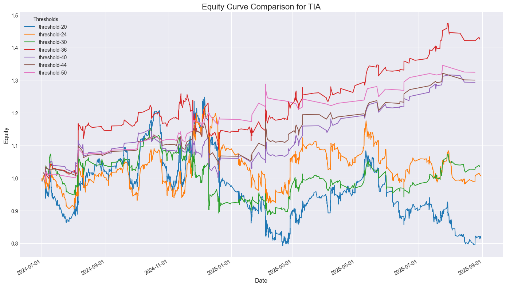
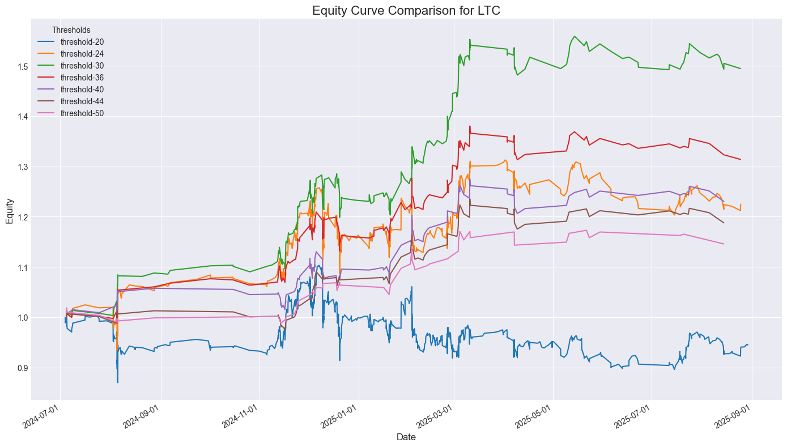
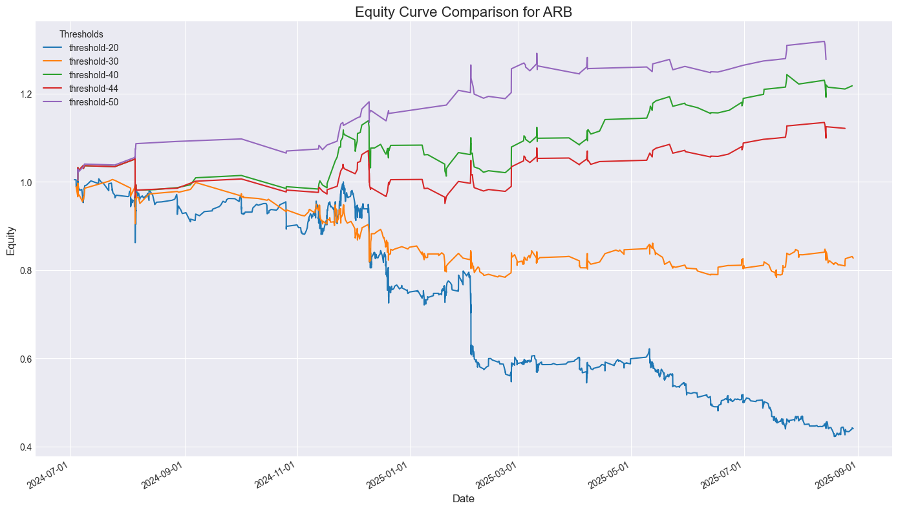

# 分钟级量化择时回测结果

> **交易对象**：Binance 永续合约  
> **平均交易费用**：单边 3 bps（含交易成本与滑点）  
> **策略版本**：基础版（未展示优化版）  

## 1. DL 策略

| 资产 | 回测图 |
|------|--------|
| TIA |  |
| LTC |  |
| SUI |  |
| SOL |  |
| BCH |  |
| DOGE |  |
| CRV |  |
| ADA |  |
| AVAX |  |

| FIL |  |

| ARB |  |

| XRP |  |

## 2. UL 策略

| 资产 | 回测图 |
|------|--------|
| ARB |  |
| AVAX |  |
| TIA |  |
| DOGE |  |
| LTC |  |

