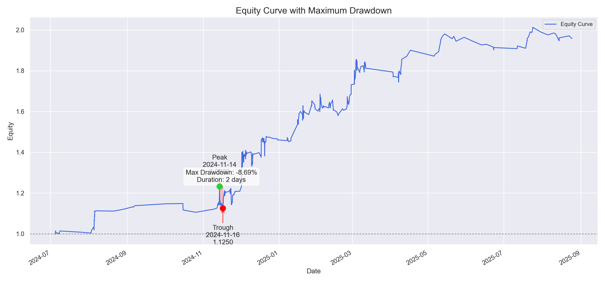
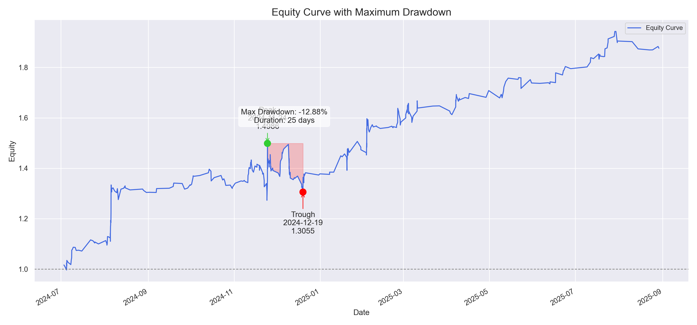
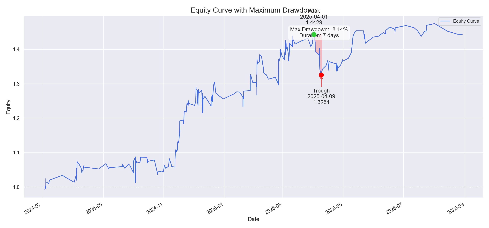
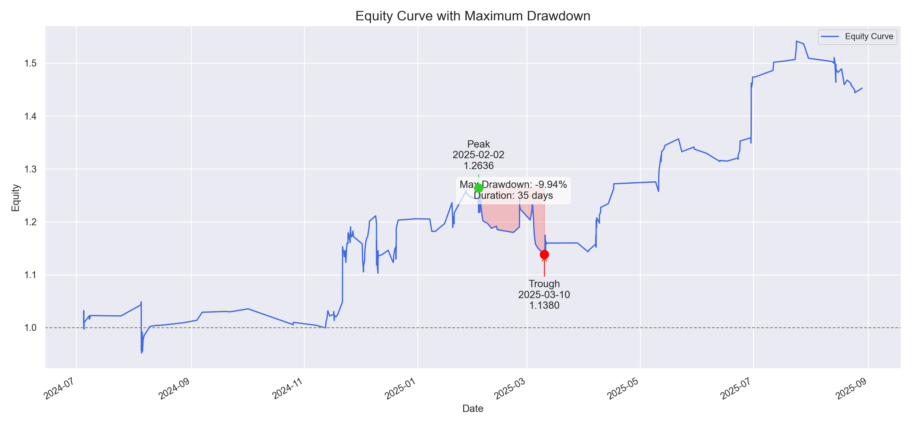
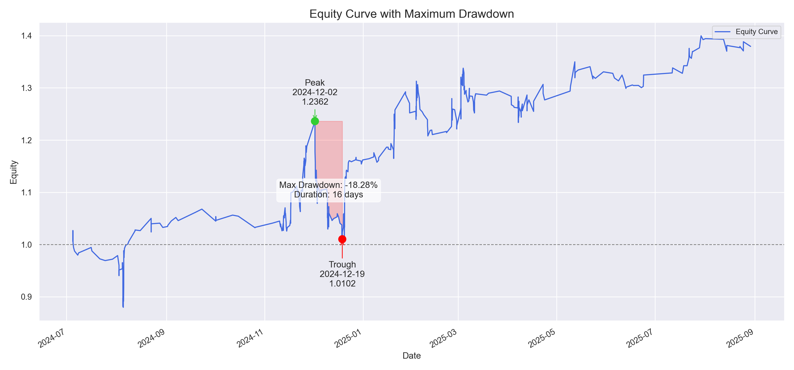

# ULDL Strategy Backtest Results / ULDL 策略回测结果

This repository publicly displays the backtest results of the ULDL quantitative strategy. The results for each cryptocurrency are detailed below.

本仓库用于公开展示 ULDL 量化策略的回测结果。各交易品种的详细回测数据如下。

## Introduction / 策略介绍

-   **Backtest Period / 回测时间**: `2024-07-01` to `2025-09-01`.
-   **Trading Costs / 交易成本**: A single-sided transaction cost of **3 basis points (bps)** is assumed, covering both trading fees and slippage. This is a reasonable estimate based on historical maker and taker fills. (单边交易成本设定为 **3 bps** (0.03%)，此费用包含交易手续费和滑点。根据历史成交记录，这是一个合理的估计。)
-   **Disclaimer / 重要声明**: The results shown here are from an **unoptimized** version of the strategy. The optimized version is not publicly disclosed. (此处展示的所有策略回测均为 **未优化** 版本。优化后版本未予公开。)

## Overall Performance Comparison / 各品种综合表现对比

| Symbol / 品种 | Cumulative Return / 累计收益 | Win Rate / 胜率 | Max Drawdown / 最大回撤 | Profit Factor / 盈亏比 | Annualized Sharpe Ratio / 年化夏普比率 |
| :------------ | :----------------------------- | :-------------- | :-------------------- | :--------------------- | :--------------------------------------- |
| **LTC**       | +95.74%                        | 56.62%          | -8.69%                | 1.14                   | 2.92                                     |
| **TIA**       | +87.61%                        | 53.12%          | -12.88%               | 1.30                   | 2.18                                     |
| **1000BONK**  | +186.85%                       | 52.80%          | -25.15%               | 1.04                   | 2.11                                     |
| **SUI**       | +44.34%                        | 52.84%          | -8.14%                | 1.18                   | 2.01                                     |
| **ARB**       | +45.27%                        | 56.79%          | -9.94%                | 1.01                   | 1.57                                     |
| **AVAX**      | +37.94%                        | 54.01%          | -18.28%               | 1.02                   | 1.51                                     |

---

## LTC Backtest Results / LTC 回测结果

### 1. Overall Performance Summary / 总体表现摘要

-   **Cumulative Return:** +95.74%
-   **Win Rate:** 56.62%
-   **Max Drawdown:** -8.69%
-   **Annualized Sharpe Ratio:** 2.92
-   **Profit Factor:** 1.14
-   **Avg Win:** 98.24 bps
-   **Avg Loss:** -86.12 bps
-   **Avg Return per Trade:** 18.27 bps

### 2. Detailed Monthly Performance Data / 月度表现数据

| Month / 月份 | Avg Return (bps) / 平均收益 (bps) | Win Rate / 胜率 |
| :----------- | :-------------------------------- | :-------------- |
| 2024-07      | 11.75                             | 43%             |
| 2024-08      | 50.35                             | 67%             |
| 2024-09      | 54.92                             | 67%             |
| 2024-10      | -47.26                            | 33%             |
| 2024-11      | 15.01                             | 62%             |
| 2024-12      | 21.52                             | 57%             |
| 2025-01      | 25.56                             | 50%             |
| 2025-02      | 12.59                             | 55%             |
| 2025-03      | 14.24                             | 56%             |
| 2025-04      | 27.00                             | 61%             |
| 2025-05      | 25.69                             | 77%             |
| 2025-06      | -36.92                            | 29%             |
| 2025-07      | 32.97                             | 58%             |
| 2025-08      | -22.97                            | 43%             |

### 3. Equity Curve / 资金曲线

---

## TIA Backtest Results / TIA 回测结果

### 1. Overall Performance Summary / 总体表现摘要

-   **Cumulative Return:** +87.61%
-   **Win Rate:** 53.12%
-   **Max Drawdown:** -12.88%
-   **Annualized Sharpe Ratio:** 2.18
-   **Profit Factor:** 1.30
-   **Avg Win:** 110.90 bps
-   **Avg Loss:** -85.57 bps
-   **Avg Return per Trade:** 18.80 bps

### 2. Detailed Monthly Performance Data / 月度表现数据

| Month / 月份 | Avg Return (bps) / 平均收益 (bps) | Win Rate / 胜率 |
| :----------- | :-------------------------------- | :-------------- |
| 2024-07      | 36.17                             | 48%             |
| 2024-08      | 43.80                             | 57%             |
| 2024-09      | 19.91                             | 64%             |
| 2024-10      | -2.84                             | 60%             |
| 2024-11      | 9.02                              | 51%             |
| 2024-12      | -1.32                             | 52%             |
| 2025-01      | 31.93                             | 41%             |
| 2025-02      | 20.24                             | 46%             |
| 2025-03      | 21.76                             | 68%             |
| 2025-04      | 21.82                             | 41%             |
| 2025-05      | 11.51                             | 56%             |
| 2025-06      | 29.65                             | 55%             |
| 2025-07      | 31.63                             | 74%             |
| 2025-08      | -24.95                            | 33%             |

### 3. Equity Curve / 资金曲线

---

## 1000BONK Backtest Results / 1000BONK 回测结果

### 1. Overall Performance Summary / 总体表现摘要

-   **Cumulative Return:** +186.85%
-   **Win Rate:** 52.80%
-   **Max Drawdown:** -25.15%
-   **Annualized Sharpe Ratio:** 2.11
-   **Profit Factor:** 1.04
-   **Avg Win:** 91.05 bps
-   **Avg Loss:** -87.57 bps
-   **Avg Return per Trade:** 6.74 bps

### 2. Detailed Monthly Performance Data / 月度表现数据

| Month / 月份 | Avg Return (bps) / 平均收益 (bps) | Win Rate / 胜率 |
| :----------- | :-------------------------------- | :-------------- |
| 2024-07      | -4.13                             | 50%             |
| 2024-08      | 16.13                             | 52%             |
| 2024-09      | -1.06                             | 54%             |
| 2024-10      | -7.13                             | 51%             |
| 2024-11      | 23.26                             | 54%             |
| 2024-12      | -5.14                             | 53%             |
| 2025-01      | 3.55                              | 46%             |
| 2025-02      | -9.26                             | 43%             |
| 2025-03      | 10.09                             | 54%             |
| 2025-04      | 13.49                             | 54%             |
| 2025-05      | 11.00                             | 59%             |
| 2025-06      | -1.61                             | 53%             |
| 2025-07      | 9.64                              | 59%             |
| 2025-08      | -3.63                             | 43%             |

### 3. Equity Curve / 资金曲线

---

## SUI Backtest Results / SUI 回测结果

### 1. Overall Performance Summary / 总体表现摘要

-   **Cumulative Return:** +44.34%
-   **Win Rate:** 52.84%
-   **Max Drawdown:** -8.14%
-   **Annualized Sharpe Ratio:** 2.01
-   **Profit Factor:** 1.18
-   **Avg Win:** 108.91 bps
-   **Avg Loss:** -92.54 bps
-   **Avg Return per Trade:** 13.90 bps

### 2. Detailed Monthly Performance Data / 月度表现数据

| Month / 月份 | Avg Return (bps) / 平均收益 (bps) | Win Rate / 胜率 |
| :----------- | :-------------------------------- | :-------------- |
| 2024-07      | 25.83                             | 45%             |
| 2024-08      | 14.35                             | 53%             |
| 2024-09      | 8.09                              | 60%             |
| 2024-10      | -5.78                             | 54%             |
| 2024-11      | 45.16                             | 67%             |
| 2024-12      | 3.54                              | 47%             |
| 2025-01      | 26.09                             | 53%             |
| 2025-02      | 19.91                             | 41%             |
| 2025-03      | 13.49                             | 61%             |
| 2025-04      | -17.46                            | 44%             |
| 2025-05      | 46.38                             | 73%             |
| 2025-06      | 19.07                             | 60%             |
| 2025-07      | 5.53                              | 44%             |
| 2025-08      | -44.51                            | 25%             |

### 3. Equity Curve / 资金曲线

---

## ARB Backtest Results / ARB 回测结果

### 1. Overall Performance Summary / 总体表现摘要

-   **Cumulative Return:** +45.27%
-   **Win Rate:** 56.79%
-   **Max Drawdown:** -9.94%
-   **Annualized Sharpe Ratio:** 1.57
-   **Profit Factor:** 1.01
-   **Avg Win:** 102.89 bps
-   **Avg Loss:** -102.17 bps
-   **Avg Return per Trade:** 14.27 bps

### 2. Detailed Monthly Performance Data / 月度表现数据

| Month / 月份 | Avg Return (bps) / 平均收益 (bps) | Win Rate / 胜率 |
| :----------- | :-------------------------------- | :-------------- |
| 2024-07      | 17.27                             | 54%             |
| 2024-08      | -3.34                             | 56%             |
| 2024-09      | 50.59                             | 75%             |
| 2024-10      | -63.19                            | 67%             |
| 2024-11      | 35.41                             | 60%             |
| 2024-12      | 7.82                              | 64%             |
| 2025-01      | 22.06                             | 44%             |
| 2025-02      | -4.89                             | 42%             |
| 2025-03      | -27.21                            | 42%             |
| 2025-04      | 49.26                             | 74%             |
| 2025-05      | 36.49                             | 71%             |
| 2025-06      | 54.72                             | 67%             |
| 2025-07      | 24.18                             | 80%             |
| 2025-08      | -19.62                            | 32%             |

### 3. Equity Curve / 资金曲线

---

## AVAX Backtest Results / AVAX 回测结果

### 1. Overall Performance Summary / 总体表现摘要

-   **Cumulative Return:** +37.94%
-   **Win Rate:** 54.01%
-   **Max Drawdown:** -18.28%
-   **Annualized Sharpe Ratio:** 1.51
-   **Profit Factor:** 1.02
-   **Avg Win:** 93.66 bps
-   **Avg Loss:** -91.83 bps
-   **Avg Return per Trade:** 8.35 bps

### 2. Detailed Monthly Performance Data / 月度表现数据

| Month / 月份 | Avg Return (bps) / 平均收益 (bps) | Win Rate / 胜率 |
| :----------- | :-------------------------------- | :-------------- |
| 2024-07      | -19.91                            | 36%             |
| 2024-08      | 17.09                             | 67%             |
| 2024-09      | 48.04                             | 86%             |
| 2024-10      | -46.75                            | 43%             |
| 2024-11      | 19.91                             | 62%             |
| 2024-12      | -1.71                             | 49%             |
| 2025-01      | 28.50                             | 48%             |
| 2025-02      | -3.96                             | 47%             |
| 2025-03      | 12.55                             | 58%             |
| 2025-04      | -3.22                             | 41%             |
| 2025-05      | 32.42                             | 69%             |
| 2025-06      | -3.13                             | 50%             |
| 2025-07      | 26.50                             | 63%             |
| 2025-08      | -9.03                             | 40%             |

### 3. Equity Curve / 资金曲线

